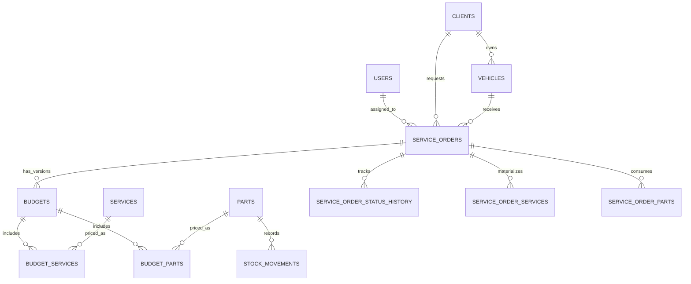

# Diagrama ER

```mermaid
erDiagram
    USERS ||--o{ SERVICE_ORDERS : assigned_to
    CLIENTS ||--o{ VEHICLES : owns
    CLIENTS ||--o{ SERVICE_ORDERS : requests
    VEHICLES ||--o{ SERVICE_ORDERS : receives
    SERVICE_ORDERS ||--o{ BUDGETS : has_versions
    BUDGETS ||--o{ BUDGET_SERVICES : includes
    BUDGETS ||--o{ BUDGET_PARTS : includes
    SERVICES ||--o{ BUDGET_SERVICES : priced_as
    PARTS ||--o{ BUDGET_PARTS : priced_as
    SERVICE_ORDERS ||--o{ SERVICE_ORDER_STATUS_HISTORY : tracks
    SERVICE_ORDERS ||--o{ SERVICE_ORDER_SERVICES : materializes
    SERVICE_ORDERS ||--o{ SERVICE_ORDER_PARTS : consumes
    PARTS ||--o{ STOCK_MOVEMENTS : records
```

